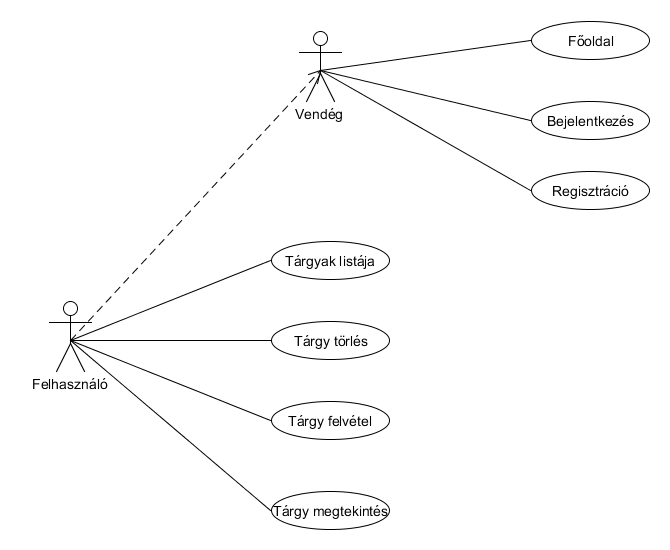
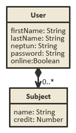
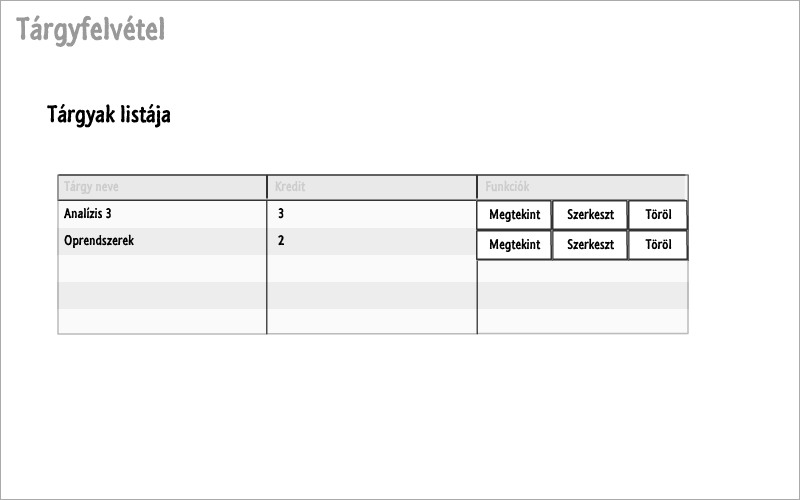

#Alkalmazások fejlesztése 3. beadandó
##Követelményanalízis
A feladat egy alkalmazás létrehozása, melyben a felhasználók bejelentkezés után kezelhetik tárgyaikat. A legelső bejelentkezés előtt a felhasználóknak regisztrálniuk kell. A felhasználók belépés után fel tudják venni a tárgyaikat. A felvett tárgyakat meg tudják tekinteni, szerkeszthetik és törölhetik a listából.

##Tervezés
###Adatmodell
A **user** tábla tartalmazza a felhasználók adatait:
  - Neptun kód
  - Jelszó
  - Vezetéknév
  - Keresztnév
  - 
A **subject** tábla tartalmazza a tárgyak adatait:
  - Tárgy neve
  - Kredit
  

###Oldaltérkép
* Publikus:
	- Főoldal
	- Bejelentkezés
	- Regisztráció
* Felhasználó
	- Főoldal
	- Bejelentkezés
	- Tárgylista
		  + tárgy felvétel
		  + tárgy törlése
		  + tárgy szerkesztése
		  + tárgy megtekintése

##Végpontok
A következő lista tartalmazza az egyes végpontokon elérhető funkciókat

* GET /: főoldal
* GET /login: bejelentkező oldal
* POST /login: bejelentkezési adatok felküldése
* GET /register: regisztráció oldal
* POST /register: regisztrációs adatok felküldése
* GET /subjects/list: tárgylista oldal
* GET /subjects/new: új tárgy felvétele
* POST /subjects/new: új tárgy felvétele, adatok küldése
* POST /subjects/list: tárgyak törlése
* GET /subjects/view: tárgy megtekintése
* GET /subjects/edit: tárgy szerkesztése
* POST /subjects/edit: tárgy szerkesztése, adatok küldése

##Implementáció
A program elkészítéséhez a *Cloud9 IDE*-t használtam, ami egy online felhő alapú fejlesztőkörnyezet rengeteg funkcióval.
Az alkalmazás *Javascript* nyelven készült, *Node.js*, valamint számos *3rd party* könyvtár használatával.
Néhány használt könyvtár:
- BootStrap CSS könyvtár: http://getbootstrap.com/
- Ember.js http://emberjs.com/

###Felépítés
Az alkalmazás **MVC** alapján készült **ember.js** és **RESTApi** használatával. Az *app/pods* mappában találhatók az alkalmazás modelljei (*subject*, *user*). A *router.js* határozza meg az alkalmazás végpontjait.
Az adatok tárolása a **RESTApi**-val történik  *.db* kiterjesztésű fájlokban.

##Tesztelés

##Felhasználói dokumentáció
Az alkalmazás futtatásához **4.1.2**-es verziójú *Node* szükséges, valamint telepíteni kell különböző *node* modulokat a a **package.json** alapján.
Ehhez használhatjuk a következő parancsot:   
 > npm install --production 
 
Továbbá telepítenünk kell még a *bower*-t:
> npm install bower -g

Ha a *./node_modules/.bin/* mappában vagyunk, akkor

- **Route**-okat a következő paranccsal generálhatunk: 
> ember generate route <route neve>

- **Component**-eket a következő paranccsal generálhatunk:  
> ember generate component <component-neve>

- **Model**-eket a következő paranccsal generálhatunk:
> ember generate model <model neve>

- **Controller**-eket a következő paranccsal generálhatunk:
> ember generate controller <controller neve>

- A **generate** parancs helyett a **destroy**-t használva törlődik az adott generált elem.

- Elindításhoz a következő parancsot használhatjuk:
> ember serve
